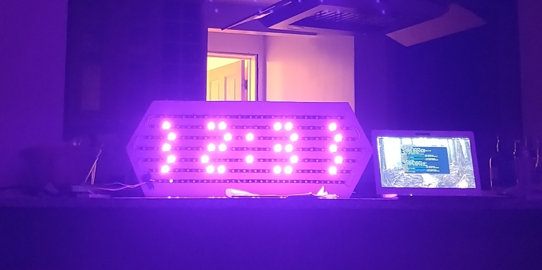

# sundial - a sunrise alarm clock
Components:
* Raspberry Pi nano W (wifi enabled)
* Logic-level shifter
* 5v, 10A power supply
* 129 WS2812 strip LEDs
* Assorted connectors, wires, and breadboard

